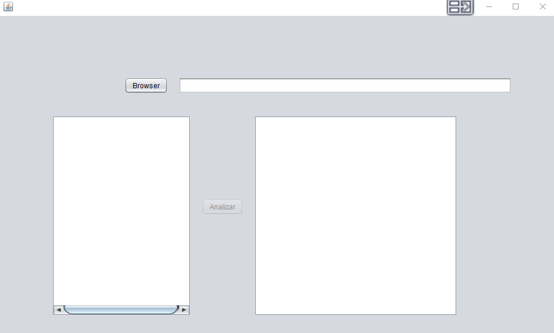
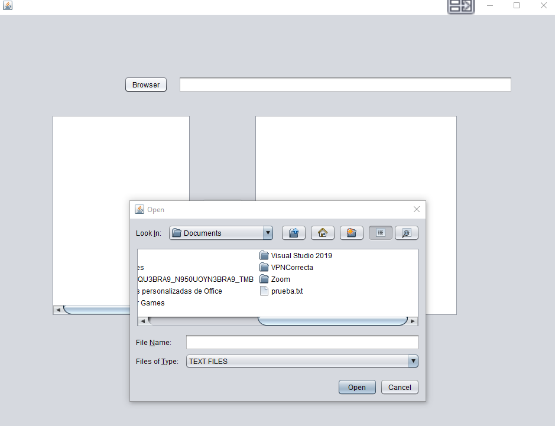
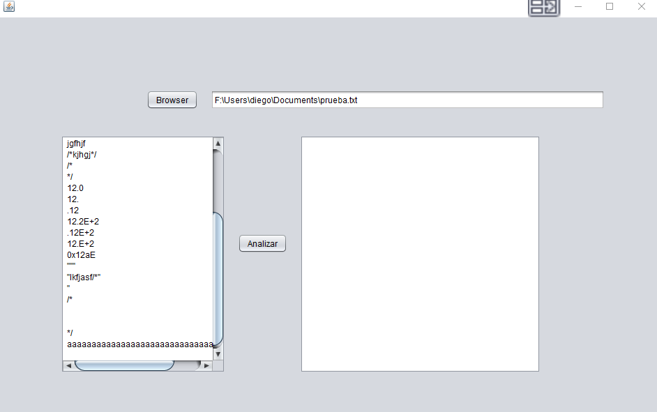
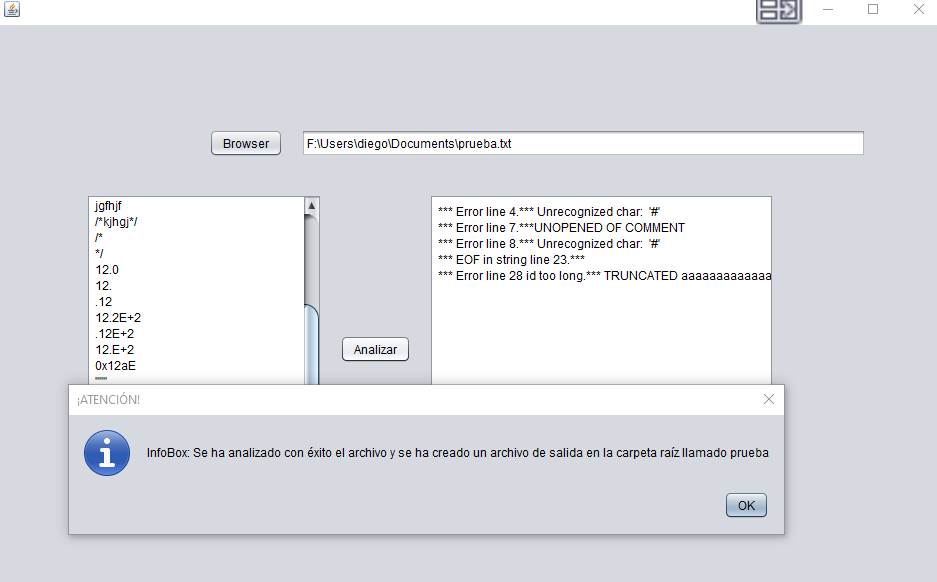

# Compiladores
Proyecto de compiladores 2020

## Descripción:
La fase 1 del proyecto consiste en realizar un analizador léxico para C#,
en el que debe validar todos las palabras reservadas del lenguaje, identificadores,
digitos, decimales, cadenas y comentarios.

##	Implementación		
En esta fase se hizo uso de la librería Regex implementando sus herramientas: Matcher
y Pattern, ya que en ellas se comparaban las cadenas del archivo a analizar versus
los patrones definidos para cada Token (Multiline, Single, Reserved, entre otros).
Cada Patrón tiene un orden definido ya que posee jerarquía al estar evaluando cada 
expresión regular, como se muestra en la Clase Tokenizar.java. Así mismo allí se definieron
los errores para cada formato de las cadenas. La clase Lexer.java se utiliza para hacer cada 
comparación entre los tokens y los patrones de Tokenizer, además de llevar el control de
las líneas y columnas que se encuentran analizando. 

```bash
Pattern p = Pattern.compile("a*b");
Matcher m = p.matcher("aaaaab");
boolean b = m.matches();
```
Utiliza la siguiente gramatica:
```bash
Stmt::= for | while | Expr ;

for:== for ( <Expr> : Expr : <Expr> ) Stmt

While:== while ( Expr ) Stmt

Expr ::=Expr || ExprAND
	|ExprAND

ExprAND:== ExprAND && ExprEQUALS
		|ExprEQUALS
	
ExprEQUALS::= ExprEQUALS == ExprREL
		| ExprEQUALS != ExprREL
		| ExprREL
		
ExprREL::= ExprREL >= ExprADD
		| ExprREL <= ExprADD
		| ExprREL > ExprADD
		| ExprREL < ExprADD
		| ExprADD
			
ExprADD::= ExprADD +  ExpMUL
		|  ExprADD - ExpMUL
		|  ExpMUL
		
ExpMUL::=  ExpMUL * ExpUN
		| ExpMUL / ExpUN
		| ExprMUL % ExpUN
		|ExpUN
		
ExpUN:== -ExpUN ExpEXP
	| ! ExpUN ExpEXP
	| ExpEXP
	
ExpEXP:== ( Expr )
		| Constant
		|LValue
		|this
		|New(ident)
		|LValue = Expr
```

##	Procedimiento	
Al iniciar el programa, se debe cargar el archivo a analizar con extensión ".txt" o ".frag" 



Al abrirlo muestra en la columna izquierda, el contenido del mismo tal cual se encuentra. 



Al presionar el botón Analizar muestra un mensaje en el que indica que ha finalizado el análisis
y que generó el archivo con extensión ".out". También se muestra en pantalla en la columna 
derecha el resultado del análisis léxico.





## Release History

* 1.0.0
    * Stable: Lexer analyzer
* 1.1.1
    * Stable: Se agregaron los dos puntos y la palabra reservada Print
* 1.1.1
    * Stable: Parser for-while-Exp

## Contributing
Desarrollado por:

Diego Dominguez – [@diegogtus](https://github.com/diegogtus) – alejandro.diego.gt@gmail.com

Walter Rodriguez – [@WalterVRodriguezG](https://github.com/WalterVRodriguezG) 

## License
[Oracle Java SE](https://www.oracle.com/downloads/licenses/javase-license1.html)
